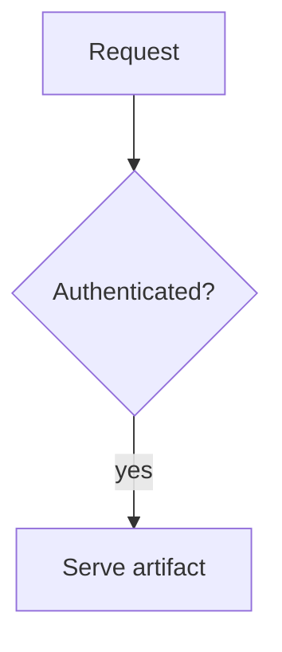

# agent-stage

**Turn an agent's markdown reasoning into an interactive, element-level review page.**

agent-stage (`ags`) takes a reasoning artifact an AI agent writes — plain markdown with a
few fenced blocks for diagrams, questions, and callouts — validates it, and serves it as a
local web page where a human annotates any single element, answers the agent's questions,
and sends it all back. No server to run, no database, no account: the loop is entirely local.

```
 agent writes artifact.md ──▶  ags present  ──▶  browser review  ──▶  ags poll  ──▶ agent
                              validate + serve    annotate/answer     feedback (TOON)
```

## Why

An agent that reasons in the open is easier to steer. Instead of a wall of text it emits a
**structured artifact** — a decision diagram here, a question there, a claim to confirm — and
a human reviews it *element by element*: click a diagram node to comment on exactly that node,
pick an option to answer, mark a thread resolved. Every reply routes back to the agent,
anchored to the thing it's about — not a paragraph number.

## Install

```sh
brew install kennworx/tap/ags
```

Or grab a [release binary](https://github.com/kennworx/agent-stage/releases) (Linux/macOS/Windows).

## Quick start

```sh
ags present examples/reasoning-demo.md   # validate, serve, open the browser
#   …review in the browser: comment on a node, answer a question, finish…
ags poll  examples/reasoning-demo.md     # the agent reads the feedback back (as TOON)
```

`present` runs the validation gate first and **refuses to serve a broken artifact**, printing
structured errors instead. `poll` blocks quietly until the human sends feedback or finishes.

## Authoring — the block vocabulary

An artifact is markdown. Prose stays prose; structured or interactive content goes in a fenced
block whose info string names a **type** and (when it takes feedback) an `#id`:

````markdown
We evaluated two hosts; portability tips the decision.



```question #commit type=radio required
Which host should we commit to?
- TypeScript
- Rust
```

```note #claim kind=claim feedback=annotate
A single self-contained binary is the right shape for v1.
```
````

The closed v1 set is **`mermaid` · `question` · `table` · `code` · `html` · `note`** (plus
implicit prose and a `theme` config block). Run `ags catalog` for the full per-type schema —
the agent reads it *before* authoring, so it never emits a block the gate would reject.

A `mermaid` block accepts **27 diagram types** — flowcharts, sequence, class, ER, state,
gantt, git graphs, mindmaps, C4, sankey, treemaps and the rest. A header outside the set is
rejected with a suggestion when it is one edit from a real one.

## Commands

| command | what it does |
| --- | --- |
| `ags present <file>` | validate → serve → open browser (`--check` = validate-only, `--fresh`, `--port`) |
| `ags poll <file>` | long-poll queued feedback as TOON (annotations, answers, render findings) |
| `ags catalog` | print the block vocabulary + per-type schema the agent authors against |
| `ags bake <file>` | emit a standalone, shareable HTML page (read-only) |

## Sharing — `ags bake`

`ags bake` turns an artifact into one finished HTML file you can email or host — the
diagrams are drawn into it, so it needs no server, no script and no network:

```sh
ags bake artifact.md --out artifact.html                   # self-contained, offline, ~10 KB
```

A baked page is **read-only** (view diagrams, themes, notes, questions; no feedback loop) and
carries a strict Content-Security-Policy in place of the served page's HTTP CSP — stricter,
in fact, because a page carrying no script can forbid script outright. Theming works
without one too: the light/dark switch and the palette picker are a radio group and a
`<select>` that CSS reads.

## How it works

One gate guards what a human ever sees. **Gate 1 is the CLI**, and it runs no browser:
it validates fence/block structure, the closed type set, per-type schema, unique ids and
HTML-chunk safety — then *draws every diagram*. A header naming a type the renderer
cannot draw, or a source that will not parse, is a validation error like any other; `ags`
emits TOON errors and refuses to serve. So an artifact that passes has a picture on every
diagram, rather than a hole discovered later in someone's browser.

There is no second gate. There used to be: diagrams were drawn in the browser, which meant
only a browser could say whether they drew, and a failed render had to be caught in-page and
hidden behind a curtain. Rendering server-side collapses that — what the old gate detected,
this one prevents.

The diagram engine is **Rust, all the way down** — parser, layout and SVG. There is no
JavaScript renderer, no headless browser and no `node_modules`: `ags` links the engine, so
the CLI that validates a diagram is the thing that draws it. Layout is a deterministic pure
function from source to SVG, so the same text draws the same picture on every machine, and
the geometry is checked for legibility — an edge through an unrelated box, two edges merged
into one line, a covered label — rather than eyeballed.

Diagrams are drawn **into the page** before it is sent, keeping a source-derived `data-id`
on every node — the exact identity a human annotation anchors to and the agent reads back.
The page arrives rendered; its script only enhances what already works.

## Feedback model

Every reply is anchored and typed. An **annotation** targets a block `#id` with an optional
sub-target (a diagram node, table cell, code line, or prose range); an **answer** targets a
`question`. Each item carries a `resolutionTarget` — `agent` acts on it, `human` is context,
`mention` only notifies — and an independent reviewer **resolved** axis. Nothing is deleted;
the review history is preserved.

When the agent redraws and an anchor no longer resolves — the node it named is gone, the
block deleted, the quoted text rewritten — the item comes back marked **detached** rather
than silently dropped. `poll` answers that question against the artifact *as it stands when
it replies*, so the same recorded comment reads attached before a redraw and detached after;
it is derived, never stored, and re-adding the node re-attaches it.

Feedback lives in a local JSONL log beside the artifact (`<artifact>.ags.jsonl`) — the file
path *is* the session identity. No database, no hosted service.
