# Diagram gallery

Every diagram kind the renderer knows, one sample at a time. Ported from the
visual-test suite that the TypeScript renderer was developed against, so the
same sources exercise the Rust port — and so a page can be looked at rather
than a test suite read.

## Hero

### Beautiful Mermaid

Mermaid rendering, made beautiful.

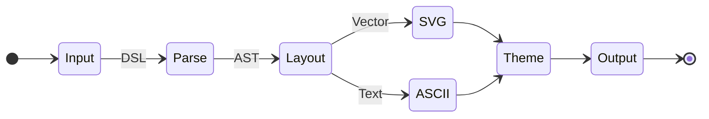

## Flowchart

### Simple Flow

Basic linear flow with three nodes connected by solid arrows.

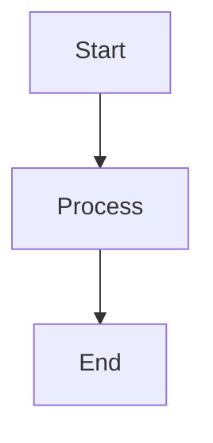

### Original Node Shapes

Rectangle, rounded, diamond, stadium, and circle.

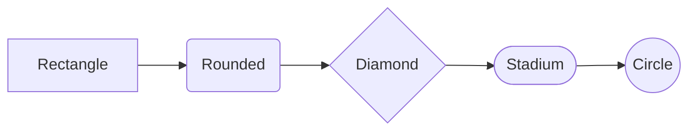

### Batch 1 Shapes

Subroutine `[[text]]`, double circle `(((text)))`, and hexagon `{{text}}`.

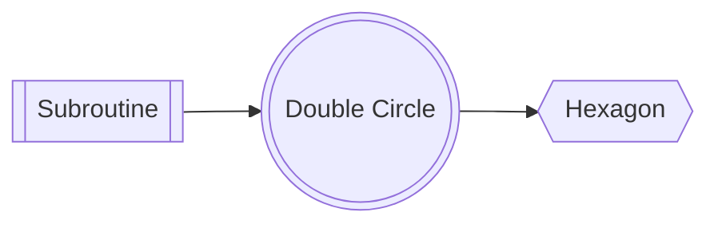

### Batch 2 Shapes

Cylinder `[(text)]`, asymmetric `>text]`, trapezoid `[/text\]`, and inverse trapezoid `[\text/]`.

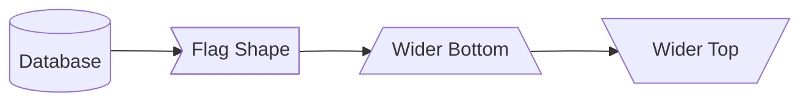

### All 12 Flowchart Shapes

Every supported flowchart shape in a single diagram.

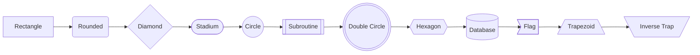

### All Edge Styles

Solid, dotted, and thick arrows with labels.

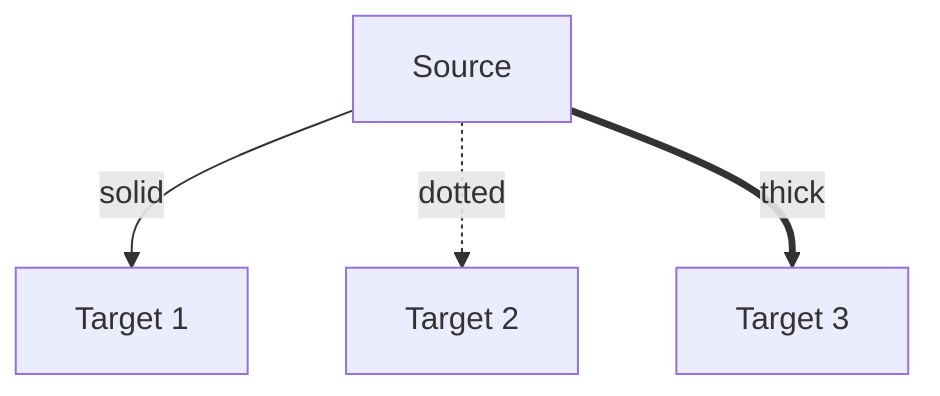

### No-Arrow Edges

Lines without arrowheads: solid `---`, dotted `-.-`, thick `===`.

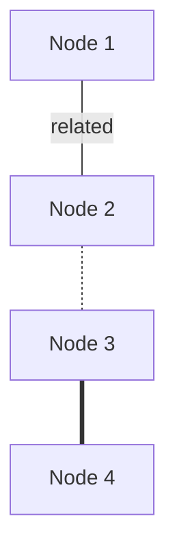

### Text-Embedded Labels

Using `-- label -->` syntax instead of `-->|label|` for edge labels.

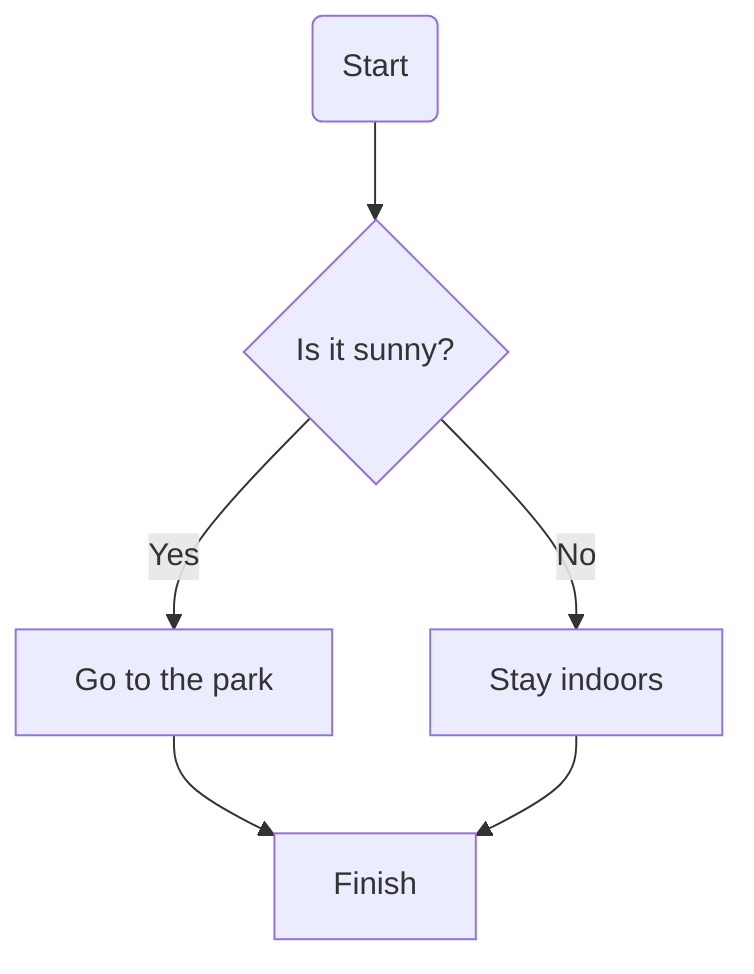

### Bidirectional Arrows

Arrows in both directions: `<-->`, `<-.->`, `<==>`.

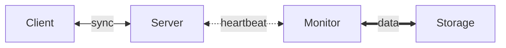

### Parallel Links (&)

Using `&` to create multiple edges from/to groups of nodes.

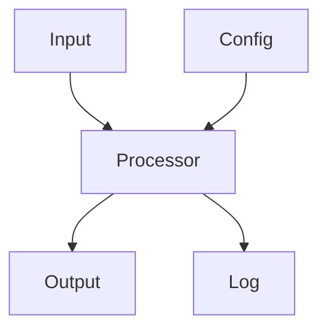

### Chained Edges

A long chain of nodes demonstrating edge chaining syntax.

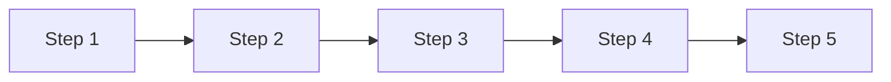

### linkStyle: Color-Coded Edges

Using `linkStyle` to color specific edges by index (0-based).

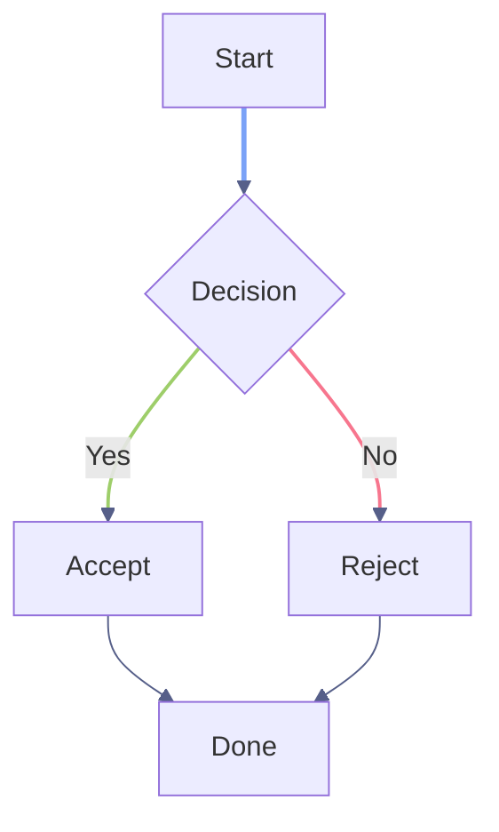

### linkStyle: Default + Override

Default edge style with index-specific overrides for critical paths.

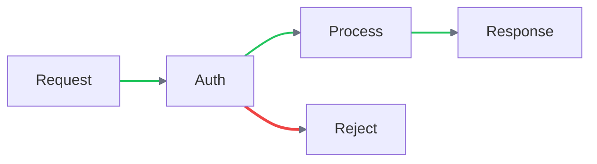

### Direction: Left-Right (LR)

Horizontal layout flowing left to right.

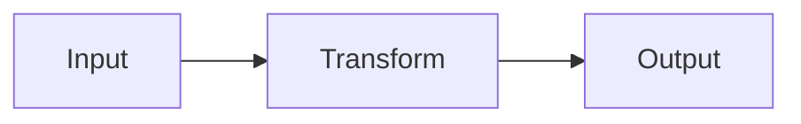

### Direction: Bottom-Top (BT)

Vertical layout flowing from bottom to top.

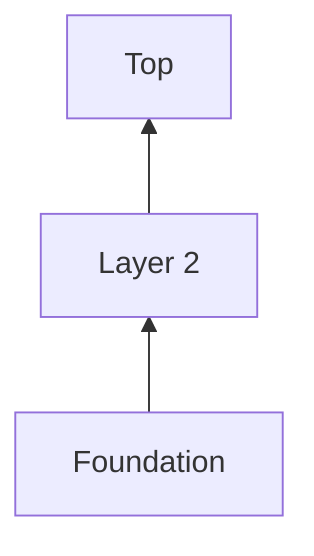

### Subgraphs

Grouped nodes inside labeled subgraph containers.

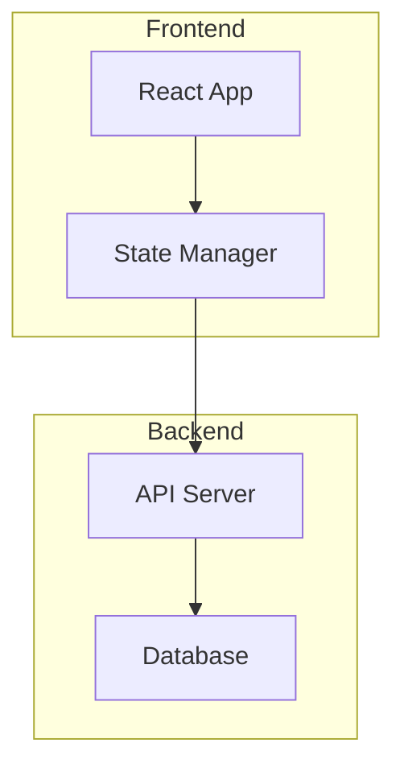

### Nested Subgraphs

Subgraphs inside subgraphs for hierarchical grouping.

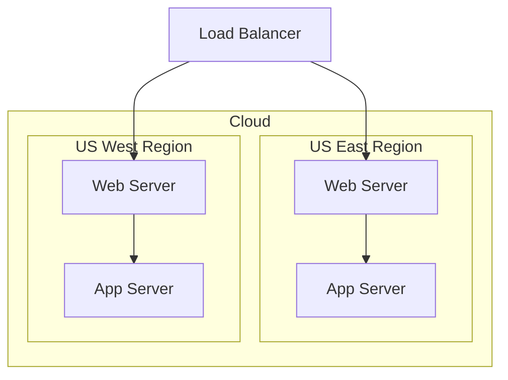

### Subgraph Direction Override

Using `direction LR` inside a subgraph while the outer graph flows TD.

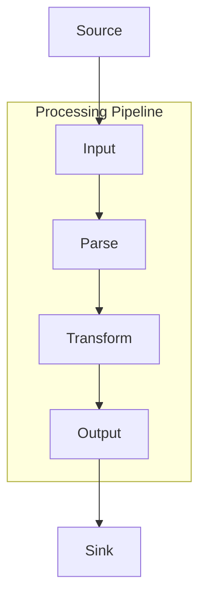

### ::: Class Shorthand

Assigning classes with `:::` syntax directly on node definitions.

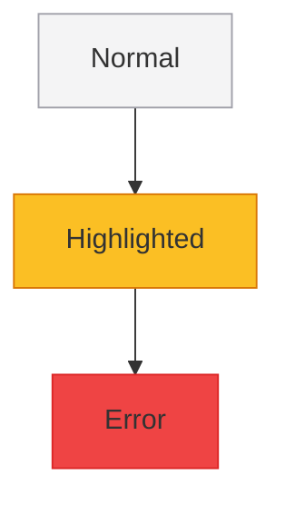

### Inline Style Overrides

Using `style` statements to override node fill and stroke colors.

```mermaid #inline-style-overrides feedback=annotate
graph TD
  A[Default] --> B[Custom Colors] --> C[Another Custom]
  style B fill:#3b82f6,stroke:#1d4ed8,color:#ffffff
  style C fill:#10b981,stroke:#059669
```

### CI/CD Pipeline

A realistic CI/CD pipeline with decision points, feedback loops, and deployment stages.

```mermaid #cicd-pipeline feedback=annotate
graph TD
  subgraph ci [CI Pipeline]
    A[Push Code] --> B{Tests Pass?}
    B -->|Yes| C[Build Image]
    B -->|No| D[Fix & Retry]
    D -.-> A
  end
  C --> E([Deploy Staging])
  E --> F{QA Approved?}
  F -->|Yes| G((Production))
  F -->|No| D
```

### System Architecture

A microservices architecture with multiple services and data stores.

```mermaid #system-architecture feedback=annotate
graph LR
  subgraph clients [Client Layer]
    A([Web App]) --> B[API Gateway]
    C([Mobile App]) --> B
  end
  subgraph services [Service Layer]
    B --> D[Auth Service]
    B --> E[User Service]
    B --> F[Order Service]
  end
  subgraph data [Data Layer]
    D --> G[(Auth DB)]
    E --> H[(User DB)]
    F --> I[(Order DB)]
    F --> J([Message Queue])
  end
```

### Decision Tree

A branching decision flowchart with multiple outcomes.

```mermaid #decision-tree feedback=annotate
graph TD
  A{Is it raining?} -->|Yes| B{Have umbrella?}
  A -->|No| C([Go outside])
  B -->|Yes| D([Go with umbrella])
  B -->|No| E{Is it heavy?}
  E -->|Yes| F([Stay inside])
  E -->|No| G([Run for it])
```

### Git Branching Workflow

A git flow showing feature branches, PRs, and release cycle.

```mermaid #git-branching-workflow feedback=annotate
graph LR
  A[main] --> B[develop]
  B --> C[feature/auth]
  B --> D[feature/ui]
  C --> E{PR Review}
  D --> E
  E -->|approved| B
  B --> F[release/1.0]
  F --> G{Tests?}
  G -->|pass| A
  G -->|fail| F
```

## State

### Basic State Diagram

A simple `stateDiagram-v2` with start/end pseudostates and transitions.

```mermaid #basic-state-diagram feedback=annotate
stateDiagram-v2
  [*] --> Idle
  Idle --> Active : start
  Active --> Idle : cancel
  Active --> Done : complete
  Done --> [*]
```

### State: Composite States

Nested composite states with inner transitions.

```mermaid #state-composite-states feedback=annotate
stateDiagram-v2
  [*] --> Idle
  Idle --> Processing : submit
  state Processing {
    parse --> validate
    validate --> execute
  }
  Processing --> Complete : done
  Processing --> Error : fail
  Error --> Idle : retry
  Complete --> [*]
```

### State: Connection Lifecycle

TCP-like connection state machine with multiple states.

```mermaid #state-connection-lifecycle feedback=annotate
stateDiagram-v2
  [*] --> Closed
  Closed --> Connecting : connect
  Connecting --> Connected : success
  Connecting --> Closed : timeout
  Connected --> Disconnecting : close
  Connected --> Reconnecting : error
  Reconnecting --> Connected : success
  Reconnecting --> Closed : max_retries
  Disconnecting --> Closed : done
  Closed --> [*]
```

### State: CJK State Names

State diagram using Chinese characters for state names.

```mermaid #state-cjk-state-names feedback=annotate
stateDiagram-v2
  [*] --> 空闲
  空闲 --> 处理中 : 提交
  处理中 --> 完成 : 成功
  处理中 --> 错误 : 失败
  错误 --> 空闲 : 重试
  完成 --> [*]
```

## Sequence

### Sequence: Basic Messages

Simple request/response between two participants.

```mermaid #sequence-basic-messages feedback=annotate
sequenceDiagram
  Alice->>Bob: Hello Bob!
  Bob-->>Alice: Hi Alice!
```

### Sequence: Participant Aliases

Using `participant ... as ...` for compact diagram IDs with readable labels.

```mermaid #sequence-participant-aliases feedback=annotate
sequenceDiagram
  participant A as Alice
  participant B as Bob
  participant C as Charlie
  A->>B: Hello
  B->>C: Forward
  C-->>A: Reply
```

### Sequence: Actor Stick Figures

Using `actor` instead of `participant` renders stick figures instead of boxes.

```mermaid #sequence-actor-stick-figures feedback=annotate
sequenceDiagram
  actor U as User
  participant S as System
  participant DB as Database
  U->>S: Click button
  S->>DB: Query
  DB-->>S: Results
  S-->>U: Display
```

### Sequence: Arrow Types

All arrow types: solid `->>` and dashed `-->>` with filled arrowheads, open arrows `-)` .

```mermaid #sequence-arrow-types feedback=annotate
sequenceDiagram
  A->>B: Solid arrow (sync)
  B-->>A: Dashed arrow (return)
  A-)B: Open arrow (async)
  B--)A: Open dashed arrow
```

### Sequence: Activation Boxes

Using `+` and `-` to show when participants are active.

```mermaid #sequence-activation-boxes feedback=annotate
sequenceDiagram
  participant C as Client
  participant S as Server
  C->>+S: Request
  S->>+S: Process
  S->>-S: Done
  S-->>-C: Response
```

### Sequence: Self-Messages

A participant sending a message to itself (displayed as a loop arrow).

```mermaid #sequence-self-messages feedback=annotate
sequenceDiagram
  participant S as Server
  S->>S: Internal process
  S->>S: Validate
  S-->>S: Log
```

### Sequence: Loop Block

A `loop` construct wrapping repeated message exchanges.

```mermaid #sequence-loop-block feedback=annotate
sequenceDiagram
  participant C as Client
  participant S as Server
  C->>S: Connect
  loop Every 30s
    C->>S: Heartbeat
    S-->>C: Ack
  end
  C->>S: Disconnect
```

### Sequence: Alt/Else Block

Conditional branching with `alt` (if) and `else` blocks.

```mermaid #sequence-altelse-block feedback=annotate
sequenceDiagram
  participant C as Client
  participant S as Server
  C->>S: Login
  alt Valid credentials
    S-->>C: 200 OK
  else Invalid
    S-->>C: 401 Unauthorized
  else Account locked
    S-->>C: 403 Forbidden
  end
```

### Sequence: Opt Block

Optional block — executes only if condition is met.

```mermaid #sequence-opt-block feedback=annotate
sequenceDiagram
  participant A as App
  participant C as Cache
  participant DB as Database
  A->>C: Get data
  C-->>A: Cache miss
  opt Cache miss
    A->>DB: Query
    DB-->>A: Results
    A->>C: Store in cache
  end
```

### Sequence: Par Block

Parallel execution with `par`/`and` constructs.

```mermaid #sequence-par-block feedback=annotate
sequenceDiagram
  participant C as Client
  participant A as AuthService
  participant U as UserService
  participant O as OrderService
  C->>A: Authenticate
  par Fetch user data
    A->>U: Get profile
  and Fetch orders
    A->>O: Get orders
  end
  A-->>C: Combined response
```

### Sequence: Critical Block

Critical section that must complete atomically.

```mermaid #sequence-critical-block feedback=annotate
sequenceDiagram
  participant A as App
  participant DB as Database
  A->>DB: BEGIN
  critical Transaction
    A->>DB: UPDATE accounts
    A->>DB: INSERT log
  end
  A->>DB: COMMIT
```

### Sequence: Notes (Right/Left/Over)

Notes positioned to the right, left, or over participants.

```mermaid #sequence-notes-rightleftover feedback=annotate
sequenceDiagram
  participant A as Alice
  participant B as Bob
  Note left of A: Alice prepares
  A->>B: Hello
  Note right of B: Bob thinks
  B-->>A: Reply
  Note over A,B: Conversation complete
```

### Sequence: OAuth 2.0 Flow

Full OAuth 2.0 authorization code flow with token exchange.

```mermaid #sequence-oauth-20-flow feedback=annotate
sequenceDiagram
  actor U as User
  participant App as Client App
  participant Auth as Auth Server
  participant API as Resource API
  U->>App: Click Login
  App->>Auth: Authorization request
  Auth->>U: Login page
  U->>Auth: Credentials
  Auth-->>App: Authorization code
  App->>Auth: Exchange code for token
  Auth-->>App: Access token
  App->>API: Request + token
  API-->>App: Protected resource
  App-->>U: Display data
```

### Sequence: Database Transaction

Multi-step database transaction with rollback handling.

```mermaid #sequence-database-transaction feedback=annotate
sequenceDiagram
  participant C as Client
  participant S as Server
  participant DB as Database
  C->>S: POST /transfer
  S->>DB: BEGIN
  S->>DB: Debit account A
  alt Success
    S->>DB: Credit account B
    S->>DB: INSERT audit_log
    S->>DB: COMMIT
    S-->>C: 200 OK
  else Insufficient funds
    S->>DB: ROLLBACK
    S-->>C: 400 Bad Request
  end
```

### Sequence: Microservice Orchestration

Complex multi-service flow with parallel calls and error handling.

```mermaid #sequence-microservice-orchestration feedback=annotate
sequenceDiagram
  participant G as Gateway
  participant A as Auth
  participant U as Users
  participant O as Orders
  participant N as Notify
  G->>A: Validate token
  A-->>G: Valid
  par Fetch data
    G->>U: Get user
    U-->>G: User data
  and
    G->>O: Get orders
    O-->>G: Order list
  end
  G->>N: Send notification
  N-->>G: Queued
  Note over G: Aggregate response
```

### Sequence: Self-Messages with Notes

Self-referencing messages inside alt blocks with notes — tests that notes clear self-message loops and stack without overlapping.

```mermaid #sequence-self-messages-with-notes feedback=annotate
sequenceDiagram
  participant User
  participant Main as Main Process
  participant Renderer
  participant Timer as 3s Fallback Timer
  User->>Main: CMD+W
  Main->>Main: event.preventDefault()
  Main->>Renderer: WINDOW_CLOSE_REQUESTED
  Main->>Timer: Start 3s timer
  alt Multiple panels
    Renderer->>Renderer: closePanel(focusedId)
    Note over Renderer: Panel removed
    Note over Renderer: No confirmCloseWindow!
    Timer-->>Main: 3s elapsed → window.destroy()
  else Single panel
    Renderer->>Renderer: closePanel(lastId)
    Note over Renderer: Stack becomes []
    Renderer->>Renderer: Auto-select fires → new panel created!
    Note over Renderer: Panel reopens
    Timer-->>Main: 3s elapsed → window.destroy()
  end
```

## Class

### Class: Basic Class

A single class with attributes and methods, rendered as a 3-compartment box.

```mermaid #class-basic-class feedback=annotate
classDiagram
  class Animal {
    +String name
    +int age
    +eat() void
    +sleep() void
  }
```

### Class: Visibility Markers

All four visibility levels: `+` (public), `-` (private), `#` (protected), `~` (package).

```mermaid #class-visibility-markers feedback=annotate
classDiagram
  class User {
    +String name
    -String password
    #int internalId
    ~String packageField
    +login() bool
    -hashPassword() String
    #validate() void
    ~notify() void
  }
```

### Class: Interface Annotation

Using `<<interface>>` annotation above the class name.

```mermaid #class-interface-annotation feedback=annotate
classDiagram
  class Serializable {
    <<interface>>
    +serialize() String
    +deserialize(data) void
  }
```

### Class: Abstract Annotation

Using `<<abstract>>` annotation for abstract classes.

```mermaid #class-abstract-annotation feedback=annotate
classDiagram
  class Shape {
    <<abstract>>
    +String color
    +area() double
    +draw() void
  }
```

### Class: Enum Annotation

Using `<<enumeration>>` annotation for enum types.

```mermaid #class-enum-annotation feedback=annotate
classDiagram
  class Status {
    <<enumeration>>
    ACTIVE
    INACTIVE
    PENDING
    DELETED
  }
```

### Class: Inheritance (<|--)

Inheritance relationship rendered with a hollow triangle marker.

```mermaid #class-inheritance--- feedback=annotate
classDiagram
  class Animal {
    +String name
    +eat() void
  }
  class Dog {
    +String breed
    +bark() void
  }
  class Cat {
    +bool isIndoor
    +meow() void
  }
  Animal <|-- Dog
  Animal <|-- Cat
```

### Class: Composition (*--)

Composition — "owns" relationship with filled diamond marker.

```mermaid #class-composition--- feedback=annotate
classDiagram
  class Car {
    +String model
    +start() void
  }
  class Engine {
    +int horsepower
    +rev() void
  }
  Car *-- Engine
```

### Class: Aggregation (o--)

Aggregation — "has" relationship with hollow diamond marker.

```mermaid #class-aggregation-o-- feedback=annotate
classDiagram
  class University {
    +String name
  }
  class Department {
    +String faculty
  }
  University o-- Department
```

### Class: Association (-->)

Basic association — simple directed arrow.

```mermaid #class-association--- feedback=annotate
classDiagram
  class Customer {
    +String name
  }
  class Order {
    +int orderId
  }
  Customer --> Order
```

### Class: Dependency (..>)

Dependency — dashed line with open arrow.

```mermaid #class-dependency feedback=annotate
classDiagram
  class Service {
    +process() void
  }
  class Repository {
    +find() Object
  }
  Service ..> Repository
```

### Class: Realization (..|>)

Realization — dashed line with hollow triangle (implements interface).

```mermaid #class-realization feedback=annotate
classDiagram
  class Flyable {
    <<interface>>
    +fly() void
  }
  class Bird {
    +fly() void
    +sing() void
  }
  Bird ..|> Flyable
```

### Class: All 6 Relationship Types

Every relationship type in a single diagram for comparison.

```mermaid #class-all-6-relationship-types feedback=annotate
classDiagram
  A <|-- B : inheritance
  C *-- D : composition
  E o-- F : aggregation
  G --> H : association
  I ..> J : dependency
  K ..|> L : realization
```

### Class: Relationship Labels

Labeled relationships between classes with descriptive text.

```mermaid #class-relationship-labels feedback=annotate
classDiagram
  class Teacher {
    +String name
  }
  class Student {
    +String name
  }
  class Course {
    +String title
  }
  Teacher --> Course : teaches
  Student --> Course : enrolled in
```

### Class: Design Pattern — Observer

The Observer (publish-subscribe) design pattern with interface + concrete implementations.

```mermaid #class-design-pattern-observer feedback=annotate
classDiagram
  class Subject {
    <<interface>>
    +attach(Observer) void
    +detach(Observer) void
    +notify() void
  }
  class Observer {
    <<interface>>
    +update() void
  }
  class EventEmitter {
    -List~Observer~ observers
    +attach(Observer) void
    +detach(Observer) void
    +notify() void
  }
  class Logger {
    +update() void
  }
  class Alerter {
    +update() void
  }
  Subject <|.. EventEmitter
  Observer <|.. Logger
  Observer <|.. Alerter
  EventEmitter --> Observer
```

### Class: MVC Architecture

Model-View-Controller pattern showing relationships between layers.

```mermaid #class-mvc-architecture feedback=annotate
classDiagram
  class Model {
    -data Map
    +getData() Map
    +setData(key, val) void
    +notify() void
  }
  class View {
    -model Model
    +render() void
    +update() void
  }
  class Controller {
    -model Model
    -view View
    +handleInput(event) void
    +updateModel(data) void
  }
  Controller --> Model : updates
  Controller --> View : refreshes
  View --> Model : reads
  Model ..> View : notifies
```

### Class: Full Hierarchy

A complete class hierarchy with abstract base, interfaces, and concrete classes.

```mermaid #class-full-hierarchy feedback=annotate
classDiagram
  class Animal {
    <<abstract>>
    +String name
    +int age
    +eat() void
    +sleep() void
  }
  class Mammal {
    +bool warmBlooded
    +nurse() void
  }
  class Bird {
    +bool canFly
    +layEggs() void
  }
  class Dog {
    +String breed
    +bark() void
  }
  class Cat {
    +bool isIndoor
    +purr() void
  }
  class Parrot {
    +String vocabulary
    +speak() void
  }
  Animal <|-- Mammal
  Animal <|-- Bird
  Mammal <|-- Dog
  Mammal <|-- Cat
  Bird <|-- Parrot
```

## ER

### ER: Basic Relationship

A simple one-to-many relationship between two entities.

```mermaid #er-basic-relationship feedback=annotate
erDiagram
  CUSTOMER ||--o{ ORDER : places
```

### ER: Entity with Attributes

An entity with typed attributes and `PK`/`FK`/`UK` key badges.

```mermaid #er-entity-with-attributes feedback=annotate
erDiagram
  CUSTOMER {
    int id PK
    string name
    string email UK
    date created_at
  }
```

### ER: Attribute Keys (PK, FK, UK)

All three key constraint types rendered as badges.

```mermaid #er-attribute-keys-pk-fk-uk feedback=annotate
erDiagram
  ORDER {
    int id PK
    int customer_id FK
    string invoice_number UK
    decimal total
    date order_date
    string status
  }
```

### ER: Exactly One to Exactly One (||--||)

One-to-one mandatory relationship.

```mermaid #er-exactly-one-to-exactly-one--- feedback=annotate
erDiagram
  PERSON ||--|| PASSPORT : has
```

### ER: Exactly One to Zero-or-Many (||--o{)

Classic one-to-many optional relationship (crow's foot).

```mermaid #er-exactly-one-to-zero-or-many---o feedback=annotate
erDiagram
  CUSTOMER ||--o{ ORDER : places
```

### ER: Zero-or-One to One-or-Many (|o--|{)

Optional on one side, at-least-one on the other.

```mermaid #er-zero-or-one-to-one-or-many-o-- feedback=annotate
erDiagram
  SUPERVISOR |o--|{ EMPLOYEE : manages
```

### ER: One-or-More to Zero-or-Many (}|--o{)

At-least-one to zero-or-many relationship.

```mermaid #er-one-or-more-to-zero-or-many---o feedback=annotate
erDiagram
  TEACHER }|--o{ COURSE : teaches
```

### ER: All Cardinality Types

Every cardinality combination in one diagram.

```mermaid #er-all-cardinality-types feedback=annotate
erDiagram
  A ||--|| B : one-to-one
  C ||--o{ D : one-to-many
  E |o--|{ F : opt-to-many
  G }|--o{ H : many-to-many
```

### ER: Identifying (Solid) Relationship

Solid line indicating an identifying relationship (child depends on parent for identity).

```mermaid #er-identifying-solid-relationship feedback=annotate
erDiagram
  ORDER ||--|{ LINE_ITEM : contains
```

### ER: Non-Identifying (Dashed) Relationship

Dashed line indicating a non-identifying relationship.

```mermaid #er-non-identifying-dashed-relationship feedback=annotate
erDiagram
  USER ||..o{ LOG_ENTRY : generates
  USER ||..o{ SESSION : opens
```

### ER: Mixed Identifying & Non-Identifying

Both solid and dashed lines in the same diagram.

```mermaid #er-mixed-identifying-non-identifying feedback=annotate
erDiagram
  ORDER ||--|{ LINE_ITEM : contains
  ORDER ||..o{ SHIPMENT : ships-via
  PRODUCT ||--o{ LINE_ITEM : includes
  PRODUCT ||..o{ REVIEW : receives
```

### ER: E-Commerce Schema

Full e-commerce database schema with customers, orders, products, and line items.

```mermaid #er-e-commerce-schema feedback=annotate
erDiagram
  CUSTOMER {
    int id PK
    string name
    string email UK
  }
  ORDER {
    int id PK
    date created
    int customer_id FK
  }
  PRODUCT {
    int id PK
    string name
    float price
  }
  LINE_ITEM {
    int id PK
    int order_id FK
    int product_id FK
    int quantity
  }
  CUSTOMER ||--o{ ORDER : places
  ORDER ||--|{ LINE_ITEM : contains
  PRODUCT ||--o{ LINE_ITEM : includes
```

### ER: Blog Platform Schema

Blog system with users, posts, comments, and tags.

```mermaid #er-blog-platform-schema feedback=annotate
erDiagram
  USER {
    int id PK
    string username UK
    string email UK
    date joined
  }
  POST {
    int id PK
    string title
    text content
    int author_id FK
    date published
  }
  COMMENT {
    int id PK
    text body
    int post_id FK
    int user_id FK
    date created
  }
  TAG {
    int id PK
    string name UK
  }
  USER ||--o{ POST : writes
  USER ||--o{ COMMENT : authors
  POST ||--o{ COMMENT : has
  POST }|--o{ TAG : tagged-with
```

### ER: School Management Schema

School system with students, teachers, courses, and enrollments.

```mermaid #er-school-management-schema feedback=annotate
erDiagram
  STUDENT {
    int id PK
    string name
    date dob
    string grade
  }
  TEACHER {
    int id PK
    string name
    string department
  }
  COURSE {
    int id PK
    string title
    int teacher_id FK
    int credits
  }
  ENROLLMENT {
    int id PK
    int student_id FK
    int course_id FK
    string semester
    float grade
  }
  TEACHER ||--o{ COURSE : teaches
  STUDENT ||--o{ ENROLLMENT : enrolled
  COURSE ||--o{ ENROLLMENT : has
```

## XY Chart

### XY: Simple Bar Chart

Basic bar chart with categorical x-axis.

```mermaid #xy-simple-bar-chart feedback=annotate
xychart-beta
    title "Product Sales"
    x-axis [Widgets, Gadgets, Gizmos, Doodads, Thingamajigs]
    bar [150, 230, 180, 95, 310]
```

### XY: Line Chart

Line chart showing revenue growth over years.

```mermaid #xy-line-chart feedback=annotate
xychart-beta
    title "Revenue Growth"
    x-axis [2018, 2019, 2020, 2021, 2022, 2023, 2024, 2025]
    line [320, 420, 540, 680, 820, 950, 1080, 1200]
```

### XY: Bar and Line Overlay

Bars with a line overlay and both axis titles.

```mermaid #xy-bar-and-line-overlay feedback=annotate
xychart-beta
    title "Monthly Revenue"
    x-axis "Month" [Jan, Feb, Mar, Apr, May, Jun, Jul, Aug, Sep, Oct, Nov, Dec]
    y-axis "Revenue (USD)" 0 --> 10000
    bar [4200, 5000, 5800, 6200, 5500, 7000, 7800, 7200, 8400, 8100, 9000, 9200]
    line [4200, 5000, 5800, 6200, 5500, 7000, 7800, 7200, 8400, 8100, 9000, 9200]
```

### XY: Horizontal Bars

Horizontal bar chart showing language popularity.

```mermaid #xy-horizontal-bars feedback=annotate
xychart-beta horizontal
    title "Language Popularity"
    x-axis [Python, JavaScript, Java, Go, Rust]
    bar [30, 25, 20, 12, 8]
```

### XY: Multiple Bar Series

Two bar series comparing years side by side.

```mermaid #xy-multiple-bar-series feedback=annotate
xychart-beta
    title "2023 vs 2024 Sales"
    x-axis [Q1, Q2, Q3, Q4]
    bar [200, 250, 300, 280]
    bar [230, 280, 320, 350]
```

### XY: Dual Lines

Two lines comparing planned vs actual values.

```mermaid #xy-dual-lines feedback=annotate
xychart-beta
    title "Planned vs Actual"
    x-axis [Jan, Feb, Mar, Apr, May, Jun, Jul, Aug]
    line [100, 145, 190, 240, 280, 320, 360, 400]
    line [90, 130, 185, 235, 275, 340, 380, 420]
```

### XY: Numeric X-Axis

Line chart using a numeric x-axis range.

```mermaid #xy-numeric-x-axis feedback=annotate
xychart-beta
    title "Distribution Curve"
    x-axis 0 --> 100
    line [4, 7, 13, 21, 31, 43, 58, 71, 84, 91, 95, 91, 84, 71, 58, 43, 31, 21, 13, 7, 4]
```

### XY: 12-Month Dataset

Full year monthly data with bar and trend line.

```mermaid #xy-12-month-dataset feedback=annotate
xychart-beta
    title "Monthly Active Users (2024)"
    x-axis [Jan, Feb, Mar, Apr, May, Jun, Jul, Aug, Sep, Oct, Nov, Dec]
    y-axis "Users" 0 --> 30000
    bar [12000, 13500, 15200, 16800, 18500, 20100, 19800, 21500, 23000, 24200, 25800, 28000]
    line [12000, 13500, 15200, 16800, 18500, 20100, 19800, 21500, 23000, 24200, 25800, 28000]
```

### XY: Horizontal Combined

Horizontal chart with both bars and a trend line.

```mermaid #xy-horizontal-combined feedback=annotate
xychart-beta horizontal
    title "Budget vs Actual"
    x-axis [Eng, Sales, Marketing, Product, Ops, HR, Finance, Legal]
    bar [500, 350, 250, 200, 150, 120, 100, 80]
    line [480, 380, 230, 180, 160, 110, 95, 75]
```

### XY: Sprint Burndown

Sprint burndown chart with actual and ideal lines.

```mermaid #xy-sprint-burndown feedback=annotate
xychart-beta
    title "Sprint Burndown"
    x-axis [D1, D2, D3, D4, D5, D6, D7, D8, D9, D10]
    y-axis "Story Points" 0 --> 80
    line [72, 65, 58, 50, 45, 38, 30, 22, 12, 0]
    line [72, 65, 58, 50, 43, 36, 29, 22, 14, 0]
```

## Quadrant

### Quadrant Chart

Two-axis tradeoff map with four labelled regions.

```mermaid #quadrant-chart feedback=annotate
quadrantChart
    title Reach vs Engagement
    x-axis Low Reach --> High Reach
    y-axis Low Engagement --> High Engagement
    quadrant-1 Expand
    quadrant-2 Promote
    quadrant-3 Re-evaluate
    quadrant-4 Improve
    Campaign A: [0.3, 0.6]
    Campaign B: [0.45, 0.23]
    Campaign C: [0.57, 0.69]
```

## Block

### Block Diagram

A multi-tier system as a uniform grid with edges.

```mermaid #block-diagram feedback=annotate
block-beta
    columns 4
    Client["Client"] space space space
    API["API Gateway"] Auth["Auth"] Cache["Cache"] Queue["Queue"]
    DB["Database"] space space Worker["Worker"]
    Client --> API
    API --> Auth
    API --> Cache
    API --> DB
    Queue --> Worker
```

## Pie

### Pie: Browser Share

Plain pie (no legend values) with many slices.

```mermaid #pie-browser-share feedback=annotate
pie title Browser Market Share
    "Chrome" : 64
    "Safari" : 19
    "Edge" : 5
    "Firefox" : 3
    "Other" : 9
```

## Timeline

### Timeline: Web History

Multiple events per period.

```mermaid #timeline-web-history feedback=annotate
timeline
    title History of the Web
    1991 : First website
    2004 : Gmail : Facebook
    2008 : Chrome : GitHub
    2015 : ES6 : React Native
```

## Packet

### Packet Diagram

Bit/byte fields laid out on a 32-bit grid.

```mermaid #packet-diagram feedback=annotate
packet
    0-15: "Source Port"
    16-31: "Destination Port"
    32-63: "Sequence Number"
```

## Radar

### Radar: Product Scores

Three series across five axes.

```mermaid #radar-product-scores feedback=annotate
radar-beta
    title Product Comparison
    axis price["Price"], perf["Performance"], ux["UX"], support["Support"], docs["Docs"]
    curve us["Us"]{4, 5, 4, 3, 5}
    curve them["Competitor"]{5, 3, 2, 4, 2}
```

## Mindmap

### Mindmap

Indented tree rendered as a mind map.

```mermaid #mindmap feedback=annotate
mindmap
  root((Beautiful Mermaid))
    Rendering
      SVG
      ASCII
    Themes
      Dark
      Light
```

### Mindmap: Shapes

Different node shapes per branch.

```mermaid #mindmap-shapes feedback=annotate
mindmap
  root((Project))
    Goals
      [Ship v1]
      (Grow users)
    Risks
      ))Scope creep((
    Team
      Design
      Engineering
```

## Tree View

### Tree View

Directory-style hierarchy with folder/file glyphs.

```mermaid #tree-view feedback=annotate
treeView-beta
  "src/"
    "index.ts"
    "parser.ts"
  "docs/"
    "guide.md"
```

## Journey

### Journey: Online Shopping

Multi-actor satisfaction journey.

```mermaid #journey-online-shopping feedback=annotate
journey
    title Online Shopping
    section Browse
      Search products : 4: Customer
      Read reviews : 3: Customer
    section Checkout
      Add to cart : 5: Customer
      Enter payment : 2: Customer, System
      Confirm order : 5: Customer
```

## Treemap

### Treemap: Codebase

Deeper hierarchy with nested branches.

```mermaid #treemap-codebase feedback=annotate
treemap
  "Repo"
    "src"
      "renderers": 60
      "parsers": 45
      "layout": 30
    "tests": 40
    "docs": 15
```

## Venn

### Venn: Three Sets

Three overlapping sets.

```mermaid #venn-three-sets feedback=annotate
venn-beta
    title Skills
    set Design
    set Code
    set Product
    union Design, Code
    union Code, Product
```

## Wardley

### Wardley Map

A value chain with anchors and an evolution path.

```mermaid #wardley-map feedback=annotate
wardley
    title Tea Shop
    anchor Business [0.95, 0.55]
    component Cup [0.84, 0.30]
    component Tea [0.70, 0.55]
    component Hot_Water [0.60, 0.70]
    component Kettle [0.45, 0.78]
    component Power [0.20, 0.92]
    Business -> Cup
    Cup -> Tea
    Tea -> Hot_Water
    Hot_Water -> Kettle
    Kettle -> Power
```

## Ishikawa

### Ishikawa (Fishbone)

Cause-and-effect diagram with categories and causes.

```mermaid #ishikawa-fishbone feedback=annotate
ishikawa
    Late Delivery
        Process
            Slow approvals
            Manual steps
        People
            Understaffed
```

## Kanban

### Kanban Board

Columns of cards.

```mermaid #kanban-board feedback=annotate
kanban
    todo[To Do]
        t1[Design spec]
        t2[Write tests]
    doing[In Progress]
        t3[Build parser]
    done[Done]
        t4[Setup CI]
```

### Kanban: With Assignees

Cards with assignee/priority metadata.

```mermaid #kanban-with-assignees feedback=annotate
kanban
    backlog[Backlog]
        b1[Spec the parser]@{ assigned: "Ana", priority: "High" }
        b2[Design icons]@{ assigned: "Lee" }
    doing[In Progress]
        d1[Wire dispatch]@{ assigned: "Sam", priority: "High" }
    done[Done]
        e1[Identity gate]
```

## Requirement

### Requirement: Verification

Multiple requirements with satisfy/verify relations.

```mermaid #requirement-verification feedback=annotate
requirementDiagram
    requirement speed {
      id: 1
      text: render under 50ms
      risk: high
      verifymethod: test
    }
    functionalRequirement themes {
      id: 2
      text: support theming
    }
    element renderer {
      type: module
    }
    element suite {
      type: tests
    }
    renderer - satisfies -> speed
    renderer - satisfies -> themes
    suite - verifies -> speed
```

## Sankey

### Sankey: Energy Flow

Multi-stage energy distribution.

```mermaid #sankey-energy-flow feedback=annotate
sankey
    Solar,Grid,30
    Wind,Grid,45
    Coal,Grid,25
    Grid,Residential,50
    Grid,Commercial,30
    Grid,Industrial,20
```

## Gantt

### Gantt Chart

Scheduled tasks with dependencies on a date axis.

```mermaid #gantt-chart feedback=annotate
gantt
    title Roadmap
    dateFormat YYYY-MM-DD
    section Design
    Research : r1, 2024-01-01, 7d
    Spec : after r1, 5d
    section Build
    Parser : after r1, 10d
```

### Gantt: Release Plan

Statuses (done/active/crit) and a milestone.

```mermaid #gantt-release-plan feedback=annotate
gantt
    title Release 2.0
    dateFormat YYYY-MM-DD
    section Planning
    Kickoff : done, k1, 2024-02-01, 3d
    Scoping : active, after k1, 5d
    section Delivery
    Build : crit, b1, after k1, 12d
    QA : after b1, 5d
    Launch : milestone, after b1, 0d
```

## Git Graph

### Git: Feature + Release

Branches, tags, and a merge back to main.

```mermaid #git-feature-release feedback=annotate
gitGraph
    commit id: "init"
    commit id: "setup" tag: "v0.1"
    branch feature
    commit id: "ui"
    commit id: "logic"
    checkout main
    commit id: "hotfix"
    merge feature tag: "v1.0"
```

## C4

### C4 Context

People and systems with relationships.

```mermaid #c4-context feedback=annotate
C4Context
    Person(user, "Customer", "A user of the product")
    System(app, "Application", "The product")
    System_Ext(email, "Email System")
    Rel(user, app, "Uses")
    Rel(app, email, "Sends via")
```

### C4: Container View

A system boundary with containers.

```mermaid #c4-container-view feedback=annotate
C4Context
    Person(user, "User", "An end user")
    System_Boundary(app, "Web App") {
      Container(spa, "SPA", "React", "The UI")
      Container(api, "API", "Node", "Business logic")
      ContainerDb(db, "Database", "Postgres", "Stores data")
    }
    Rel(user, spa, "Uses")
    Rel(spa, api, "Calls", "JSON/HTTP")
    Rel(api, db, "Reads/Writes")
```

## Architecture

### Architecture

Grouped services with icons and side-anchored edges.

```mermaid #architecture feedback=annotate
architecture-beta
    group cloud(cloud)[Cloud]
    service web(server)[Web] in cloud
    service db(database)[DB] in cloud
    service disk(disk)[Storage] in cloud
    web:R -- L:db
    db:B -- T:disk
```

### Architecture: Junction

A junction routing edges between services.

```mermaid #architecture-junction feedback=annotate
architecture-beta
    group net(internet)[Network]
    service gateway(server)[Gateway] in net
    service api1(server)[API 1] in net
    service api2(server)[API 2] in net
    junction j in net
    gateway:B -- T:j
    j:L -- T:api1
    j:R -- T:api2
```

### Architecture: Nested Groups

A region group nested inside a cloud group.

```mermaid #architecture-nested-groups feedback=annotate
architecture-beta
    group cloud(cloud)[Cloud]
    group region(server)[Region A] in cloud
    service web(server)[Web] in region
    service db(database)[DB] in region
    service cdn(internet)[CDN] in cloud
    web:R --> L:db
    cdn:L --> T:web
```

### Architecture: Data Pipeline

Ingestion → parallel workers → storage, with branching and fan-in.

```mermaid #architecture-data-pipeline feedback=annotate
architecture-beta
    group ingestion(internet)[Ingestion]
    group processing(cloud)[Processing]
    group storage(disk)[Storage]
    service api(server)[API] in ingestion
    service stream(queue)[Stream] in ingestion
    service w1(cpu)[Worker 1] in processing
    service w2(cpu)[Worker 2] in processing
    service cache(database)[Cache] in processing
    service warehouse(database)[Warehouse] in storage
    service archive(disk)[Archive] in storage
    api:R --> L:stream
    stream:R --> L:w1
    stream:R --> L:w2
    w1:R --> L:cache
    w2:R --> L:warehouse
    cache:R --> L:warehouse
    warehouse:B --> T:archive
```

### Architecture: Microservices

Multiple groups — edge, services, and data tiers.

```mermaid #architecture-microservices feedback=annotate
architecture-beta
    group edge(internet)[Edge]
    group svc(cloud)[Services]
    group data(disk)[Data]
    service gw(server)[Gateway] in edge
    service users(server)[Users] in svc
    service orders(server)[Orders] in svc
    service cache(database)[Cache] in data
    service db(database)[DB] in data
    gw:R --> L:users
    users:R --> L:orders
    users:B --> T:cache
    cache:R --> L:db
    orders:B --> T:db
```

## Event Modeling

### Event Modeling: Order Flow

A fuller command/event/read-model sequence.

```mermaid #event-modeling-order-flow feedback=annotate
eventmodeling
    title Order Placement
    tf 01 ui OrderForm
    tf 02 cmd PlaceOrder
    tf 03 evt OrderPlaced
    tf 04 pcr ChargeCard
    tf 05 evt PaymentTaken
    tf 06 rmo OrderStatus
```

## ZenUML

### ZenUML

Textual sequence DSL with method calls.

```mermaid #zenuml feedback=annotate
zenuml
    Alice->Bob: Request
    Bob.process()
    Bob->Alice: Response
```

### ZenUML: Login Flow

Annotators, nested calls, and returns.

```mermaid #zenuml-login-flow feedback=annotate
zenuml
    @Actor User
    @Boundary LoginPage
    @Control AuthService
    @Database UserDB
    User->LoginPage: enter credentials
    LoginPage.authenticate(user, pass) {
      AuthService.validate() {
        UserDB.findUser()
        return record
      }
      return token
    }
    LoginPage->User: show dashboard
```

### ZenUML: Control Flow

Loop and alt fragments — beyond a flat message flow.

```mermaid #zenuml-control-flow feedback=annotate
zenuml
    @Actor User
    participant Server
    loop (3 times) {
      User->Server: poll
      alt (ready) {
        Server->User: data
      } else {
        Server->User: wait
      }
    }
```
