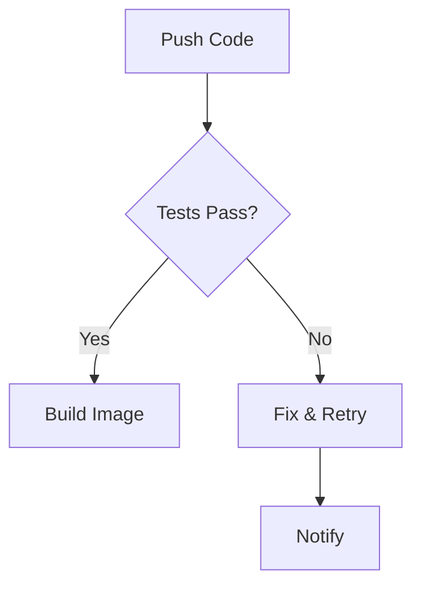
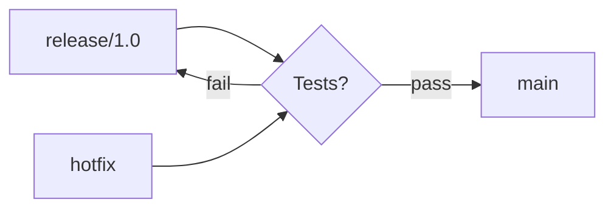
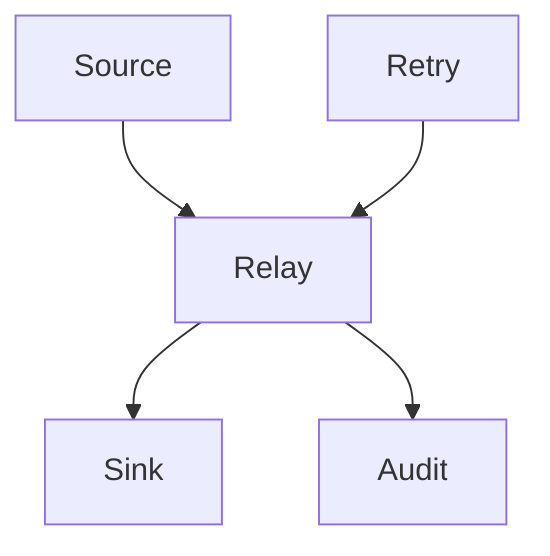
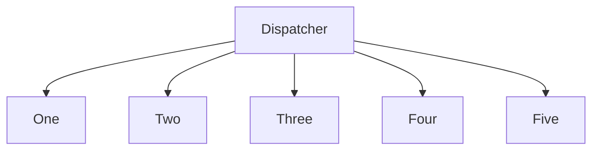
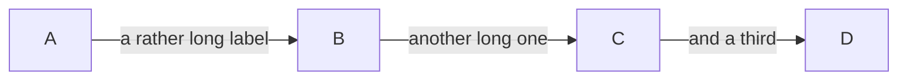

# Legibility: what the checker cannot see

Every diagram here passes `ags present` with no findings. That is the point: each
one is a defect the geometry rules have no rule for, so the only thing that
reports it is an eye. If one of these looks fine to you, say so — the rule should
not exist.

## 1. A port on a shape that has no side there

A diamond's bottom is a **vertex**, not a face. Ports are spread along the
bounding box, so two edges leaving that vertex are pushed apart onto a side that
is not there and have to step back to reach the point.

The same shape met from the side, where it is worse because two edges arrive and
two leave:

## 2. Two edges on different faces of one box

Nothing keeps an edge arriving at the top of a box clear of one leaving its
side. They are governed by separate spreads that do not know about each other.

## 3. A box with more edges than its side can hold

The box grows to fit its ports now, so this should be clean — included so the
fix has something to be judged against rather than taken on trust.

## 4. A label with nowhere good to go

An edge label is placed beside its run and clear of the boxes. When the run is
short and the boxes are close, "beside" runs out of room.

