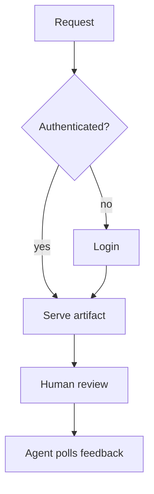

# Reasoning artifact — review demo

```theme #catppuccin
dark:
background: #1e1e2e
foreground: #cdd6f4
card: #313244
muted-foreground: #a6adc8
border: #45475a
primary: #cba6f7
primary-foreground: #1e1e2e
light:
background: #eff1f5
foreground: #4c4f69
card: #ccd0da
muted-foreground: #6c6f85
border: #bcc0cc
primary: #8839ef
primary-foreground: #eff1f5
```

```theme #rose-pine
dark:
background: #191724
foreground: #e0def4
card: #1f1d2e
muted-foreground: #908caa
border: #26233a
primary: #c4a7e7
primary-foreground: #191724
light:
background: #faf4ed
foreground: #575279
card: #fffaf3
muted-foreground: #797593
border: #cecacd
primary: #907aa9
primary-foreground: #fffaf3
```

```theme #tokyo-night
dark:
background: #1a1b26
foreground: #c0caf5
card: #24283b
muted-foreground: #565f89
border: #292e42
primary: #7aa2f7
primary-foreground: #1a1b26
light:
background: #e1e2e7
foreground: #3760bf
card: #d0d5e3
muted-foreground: #848cb5
border: #a8aecb
primary: #2e7de9
primary-foreground: #e1e2e7
```

```theme #gruvbox
dark:
background: #282828
foreground: #ebdbb2
card: #3c3836
muted-foreground: #a89984
border: #504945
primary: #fe8019
primary-foreground: #282828
light:
background: #fbf1c7
foreground: #3c3836
card: #ebdbb2
muted-foreground: #7c6f64
border: #d5c4a1
primary: #af3a03
primary-foreground: #fbf1c7
```

```theme #solarized
dark:
background: #002b36
foreground: #93a1a1
card: #073642
muted-foreground: #586e75
border: #586e75
primary: #268bd2
primary-foreground: #fdf6e3
light:
background: #fdf6e3
foreground: #657b83
card: #eee8d5
muted-foreground: #93a1a1
border: #93a1a1
primary: #268bd2
primary-foreground: #fdf6e3
```

```theme #one
dark:
background: #282c34
foreground: #abb2bf
card: #2c313a
muted-foreground: #5c6370
border: #3b4048
primary: #61afef
primary-foreground: #282c34
light:
background: #fafafa
foreground: #383a42
card: #f0f0f1
muted-foreground: #a0a1a7
border: #d4d4d4
primary: #4078f2
primary-foreground: #fafafa
```

```theme #dusk
seed: #6a5acd
```

```theme #slate
dark:
background: #0f1720
foreground: #e2e8f0
primary: #38bdf8
light:
background: #f8fafc
foreground: #0f172a
primary: #0284c7
```

This is an agent-authored reasoning artifact. Open it with `ags present` and you
get a live review page: annotate any block, click a diagram node to anchor a
comment to it, answer the open questions, and finish the review — all of which
flow back to the agent via `ags poll`.

The card below is a themed **html** block: it uses the renderer's kit classes and
named icons, with every color coming from theme tokens (no hardcoded hex), so it
re-colors with each theme above and reads in both light and dark.

```html #legend
<div class="ui-card">
  <p><strong>Review legend</strong></p>
  <p class="ui-muted">Every control here is styled from theme tokens — no per-artifact color.</p>
  <ul>
    <li><span class="ui-pill"><span data-icon="check"></span> answer</span> resolves an open question</li>
    <li><span class="ui-pill"><span data-icon="spark"></span> annotate</span> anchors a note to a block or node</li>
    <li><span class="ui-chip"><span data-icon="info"></span> chip</span> tags an inline detail</li>
  </ul>
  <p><span class="ui-primary">primary</span> and <span class="ui-muted">muted</span> text both derive from the active theme.</p>
</div>
```

Click any node in the flowchart below to comment on it — an annotation is keyed to
that node's identity, so it stays attached when the diagram is redrawn.



The store choice below drives latency and operational complexity — the main
tradeoff we want a human to confirm before we commit.

```table #matrix
| Option | Latency | Complexity | Durable |
| --- | --- | --- | --- |
| In-memory | low | low | no |
| Redis | low | high | yes |
| SQLite | medium | medium | yes |
```

A **note** block is an addressable callout — an `info`/`warn` aside or a `claim`
the human can answer. It renders as prose, follows the theme, and (with an `#id`)
takes annotations like any other block:

```note #note-latency kind=warn feedback=annotate
Redis wins on latency but adds an operational dependency — a server to run and
monitor. For a single-user review tool that may not be worth it; weigh it against
SQLite before committing.
```

The before/after below is a **custom diagram** — a themed `html` block built from
the `.ui-diagram-*` primitives (not Mermaid, which can't place a 2-D comparison).
Every box carries a `data-id`, so you can click one to anchor a comment to it,
just like a diagram node. It re-colors with the theme.

```html #migration feedback=annotate
<div class="ui-diagram">
  <div class="ui-diagram-grid" style="grid-template-columns: 1fr auto 1fr">
    <div class="ui-diagram-region">
      <div class="ui-diagram-region-title">Before</div>
      <div class="ui-diagram-node" data-id="before-store">In-memory store</div>
      <div class="ui-diagram-node" data-id="before-loss">Feedback lost on restart</div>
    </div>
    <span class="ui-diagram-arrow">→</span>
    <div class="ui-diagram-region">
      <div class="ui-diagram-region-title">After</div>
      <div class="ui-diagram-node" data-id="after-store">SQLite store</div>
      <div class="ui-diagram-node" data-id="after-durable">Durable across restarts</div>
    </div>
  </div>
  <div class="ui-diagram-label">Trades a little write latency for durable review state.</div>
</div>
```

Here is the core of the return leg the host runs once feedback is submitted:

```code #snippet lang=rust
fn deliver(session: &Session) -> io::Result<String> {
    let items = session.drain()?;
    Ok(poll_to_toon(&items, session.is_ended()))
}
```

The decision rests on one claim we want confirmed outright — a `kind=claim` note
carries a yes/no answer inline (and still takes annotations):

```note #claim-portability kind=claim feedback=annotate
A single self-contained binary with an embedded store is the right shape for v1:
no external services, portable, durable across restarts.
```

```question #q1 type=radio required
Which store should we use for v1?
- In-memory
- Redis
- SQLite
```

```question #q2 type=radio
Is the request→auth→serve→review flow above correct?
- Yes, ship it
- No, I left a comment on the diagram
```
