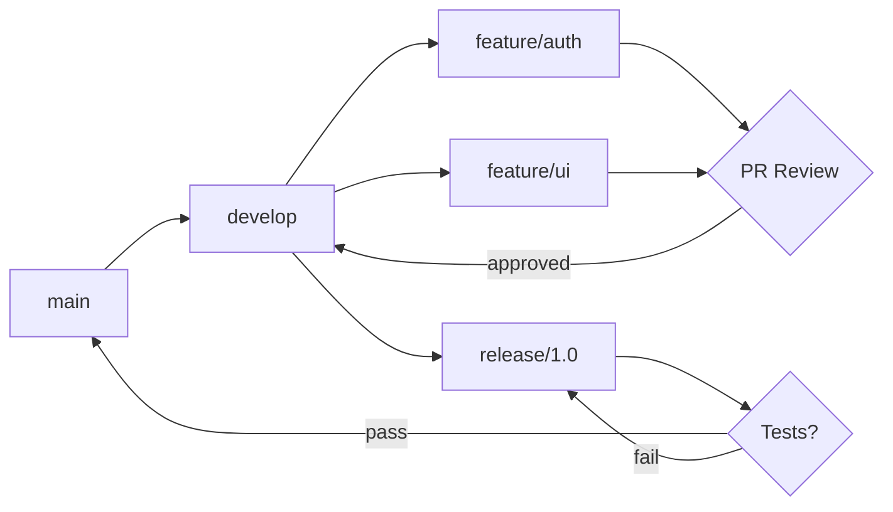
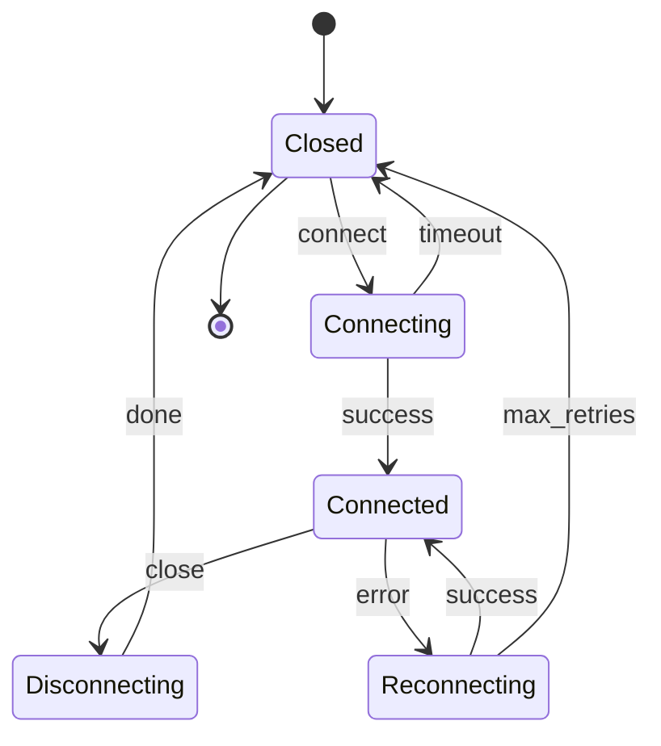
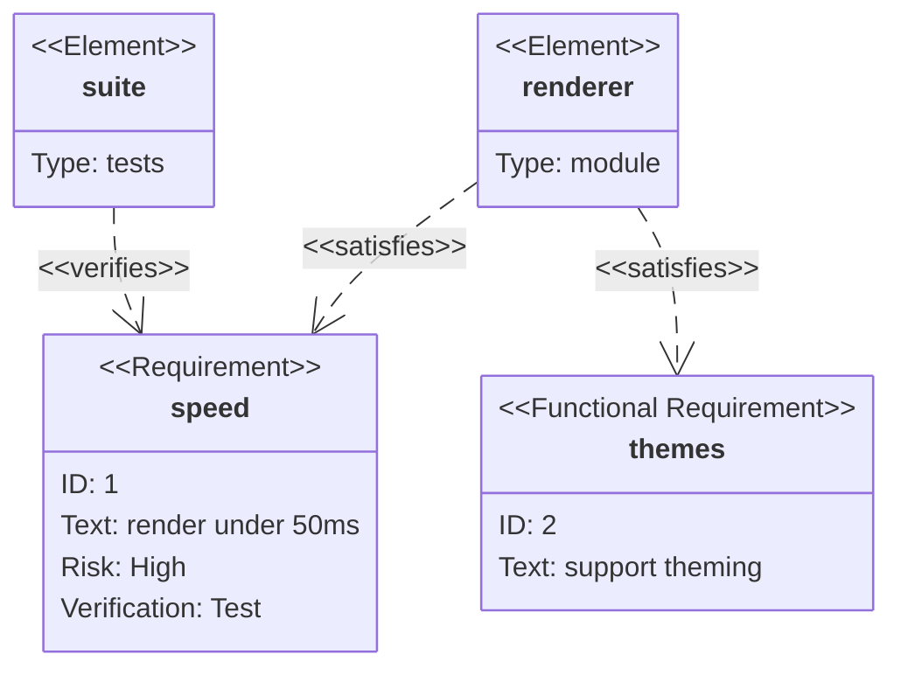

# Under review

The three diagrams still being worked on, on their own so a change to one is
visible without scrolling past a hundred that did not change.

## git-branching-workflow

`approved` dips 43px below both of its own endpoints. The dip is the row
placement gave its dummy chain, not the lane. **Open — task #12.**

## state-connection-lifecycle

`error`/`success` no longer cross. But `close`, `done` and `max_retries`
each bend more times than the shape needs. **Open — task #13.**

## requirement-verification

`«satisfies»` and `«verifies»` printed on top of each other; they now sit on
their own lines. **Fixed.**

